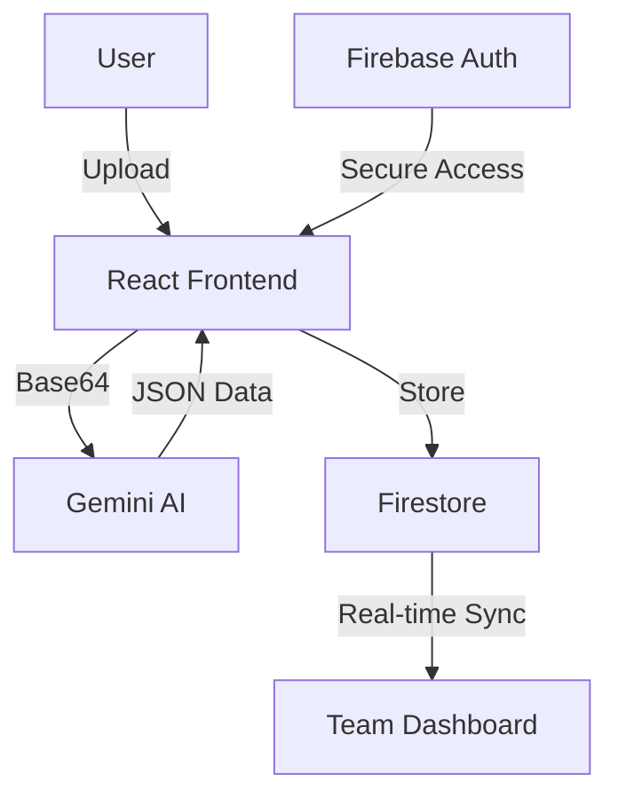

# DocManager: Product Demo & Technical Showcase

> **Note to Hiring Managers**: This document serves as a visual walkthrough of the DocManager application. It highlights the core features, AI integration, and architectural decisions. For a deep-dive into the code and system design, please see our **[Technical Documentation](TECHNICAL_DOC.md)**.

---

## 🎥 Product Walkthrough Video

> *Tip: Record a 60-second walkthrough showing the AI extraction and visual overlays in action!*

---

## 🚀 Production-Ready Document Intelligence
DocManager is now fully optimized for production environments, featuring robust error handling, secure RBAC, and a scalable architecture designed to handle high-volume document processing.

## 1. The Dashboard (Real-Time Overview)

*   **Key Feature**: Real-time metrics powered by Firestore listeners.
*   **Technical Detail**: Uses `onSnapshot` to ensure that as soon as a document is validated by one team member, the dashboard updates for everyone instantly.

## 2. AI-Powered Upload & Extraction

*   **The Workflow**: Users drop a PDF or Image.
*   **The AI**: The system sends the base64 data to **Gemini 1.5 Flash**.
*   **Zero-Shot Learning**: Unlike traditional OCR, DocManager doesn't need templates. It "reads" the document like a human and extracts fields based on context.

## 3. Human-in-the-Loop (HITL) Validation

*   **Side-by-Side Review**: High-fidelity PDF/Image preview on the left, editable AI data on the right.
*   **Confidence Scoring**: Fields with <80% confidence are automatically highlighted in red to prevent human error.

## 4. Visual Inspection & Data-Centric AI (Landing AI Inspired)

*   **Detection Overlays**: Visual bounding boxes highlight exactly where the AI "looked" to find the Vendor Name, Date, and Amount.
*   **Feedback Loop**: Users can click the "Zap" icon next to any field to provide feedback, ensuring the model learns from human expertise over time.

## 5. Document Blueprints & Automated Validation

*   **Schema Builder**: Define strict extraction schemas for different document types (Invoices, Contracts, IDs).
*   **Automated Logic Checks**: Set custom validation rules (Regex, Numeric Range, Required) that automatically flag documents failing your business logic.

## 8. Usage Tutorial (Onboarding)

*   **Simplified Onboarding**: A dedicated sidebar module that explains the app's features in simple, non-technical language.
*   **Step-by-Step Guide**: Helps users understand the Upload -> AI Magic -> Validate workflow in seconds.

## 8. Secure Audit Trails

*   **Compliance**: Every action (Upload, Validate, Reject) is logged.
*   **Security**: Firestore Security Rules ensure that only authorized users can modify documents or view logs.

## 5. Technical Architecture

---

## 🚀 Why This Project?
DocManager solves a real-world business problem: **Data Accuracy at Scale**. It demonstrates proficiency in:
1.  **Generative AI Integration** (Prompt engineering, JSON response parsing).
2.  **Real-time Cloud Databases** (Firestore).
3.  **Enterprise UI/UX** (HITL patterns, accessibility, responsive design).
4.  **Security & Compliance** (Audit logs, RBAC).

---
**Contact Information:**
[Your Name] | [Your Email] | [Your LinkedIn]
