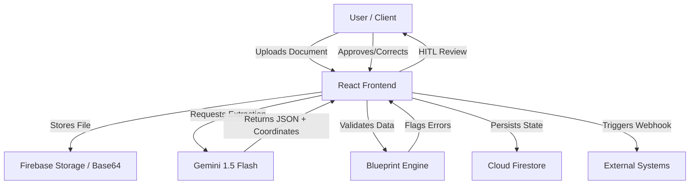

# Technical Documentation: DocManager Architecture & Implementation

Welcome to the technical deep-dive of **DocManager**. This document is intended for developers, architects, and technical contributors who want to understand the inner workings of the platform.

## 🏗️ Architecture Overview

DocManager is built as a modern full-stack Single Page Application (SPA) leveraging the power of Generative AI for unstructured data processing.

### System Flow Diagram



## 🛠️ Tech Stack

- **Frontend**: React 18+ with TypeScript & Vite.
- **Styling**: Tailwind CSS for utility-first design.
- **Animations**: Framer Motion for interactive overlays and transitions.
- **Backend/Database**: Firebase (Firestore, Authentication).
- **AI Engine**: Google Gemini 1.5 Flash via `@google/genai`.
- **UI Components**: Radix UI primitives & Lucide icons.

## 🧠 Key Technical Concepts

### 1. Schema-Driven Extraction (Blueprints)
Unlike traditional OCR which just returns text, DocManager uses **Document Blueprints**. These are JSON-based schemas that we inject into the Gemini prompt. This forces the LLM to act as a structured data parser, ensuring the output matches the expected types (string, number, date, etc.).

### 2. Dynamic Visual Localization
We utilize Gemini's spatial reasoning capabilities to extract bounding box coordinates.
- **Coordinate System**: Normalized 0-100 scale.
- **Implementation**: The AI returns `top`, `left`, `width`, and `height` for every field. The frontend then renders absolute-positioned `motion.div` elements over the document preview.

### 3. Human-in-the-Loop (HITL) Validation
The application implements a state machine for document status:
`pending` -> `flagged` (if validation fails) -> `validated` (after human approval).
This ensures that AI errors are caught before data enters downstream production systems.

### 4. Data-Centric AI Feedback
Every field has a "Model Feedback" trigger. In a production environment, this feedback would be logged to a separate collection to fine-tune future prompts or train specialized models.

## 📂 Project Structure

```text
src/
├── components/       # Reusable UI components (Modals, Badges, etc.)
├── services/         # External integrations (Gemini, Firebase)
├── lib/              # Utility functions (cn, validation logic)
├── types.ts          # Centralized TypeScript interfaces
└── App.tsx           # Main application logic & routing
```

## 🤝 Contributing

We welcome contributions from the community! Whether it's fixing a bug, adding a new feature, or improving documentation.

### How to Contribute:
1. **Fork the Repo**: Create your own branch for features or fixes.
2. **Follow Standards**: We use TypeScript for type safety and Tailwind for styling.
3. **Submit a PR**: Provide a clear description of your changes and why they are needed.

**Note to Contributors**: We are particularly interested in new validation rules, support for more document formats, and integrations with third-party ERPs/CRMs.

---
*Built with ❤️ for the Open Source AI Community.*
