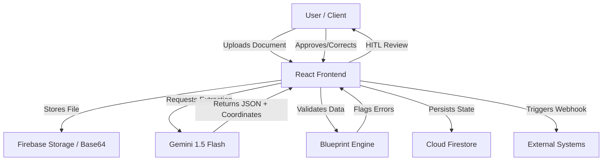

# Technical Documentation: DocManager Architecture & Implementation

Welcome to the technical deep-dive of **DocManager**. This document is intended for developers, architects, and technical contributors who want to understand the inner workings of the platform.

## 🏗️ Architecture Overview

DocManager is built as a modern full-stack Single Page Application (SPA) leveraging the power of Generative AI for unstructured data processing.

### Design Philosophy: Human-in-the-Loop (HITL)
The core architectural decision of DocManager is the **HITL workflow**. Recognizing that AI is probabilistic, we prioritize **Data Integrity** over 100% automation. The system implements a state machine (`pending` -> `flagged` -> `validated`) that ensures a human validation gate exists before data is integrated into downstream production systems.

### System Flow Diagram



## 🛠️ Tech Stack

- **Frontend**: React 18+ with TypeScript & Vite.
- **Styling**: Tailwind CSS for utility-first design.
- **Animations**: Framer Motion for interactive overlays and transitions.
- **Backend/Database**: Firebase (Firestore, Authentication).
- **AI Engine**: Google Gemini 1.5 Flash via `@google/genai`.
- **UI Components**: Radix UI primitives & Lucide icons.

## 🧠 Key Technical Concepts

### 1. Schema-Driven Extraction (Blueprints)
Unlike traditional OCR which just returns text, DocManager uses **Document Blueprints**. These are JSON-based schemas injected into the Gemini prompt. This forces the LLM to act as a structured data parser, ensuring the output matches expected types.
- **Double-Pass Validation**: 
    - *Pass 1*: AI extracts based on the schema.
    - *Pass 2*: The Frontend runs local TypeScript logic (Regex, Range checks) to verify the AI's work.

### 2. Dynamic Visual Localization
We utilize Gemini's spatial reasoning capabilities to extract bounding box coordinates.
- **Coordinate System**: Normalized 0-100 scale.
- **Implementation**: The AI returns `top`, `left`, `width`, and `height` for every field. This makes the overlays resolution-independent, scaling perfectly across all device types.

### 3. Real-Time State Management
DocManager utilizes **Cloud Firestore** for its reactive programming model.
- **Reactive Sync**: Using `onSnapshot` listeners, the Dashboard, Audit Logs, and Validation views are synchronized across all connected clients instantly without page refreshes.

### 4. Security & Compliance
- **RBAC**: Role-Based Access Control is enforced at the database layer via Firestore Security Rules.
- **PII Redaction**: A conditional masking layer identifies and hides sensitive data based on AI-identified PII fields.

## 📂 Project Structure

```text
src/
├── components/       # Reusable UI components (Modals, Badges, etc.)
├── services/         # External integrations (Gemini, Firebase)
├── lib/              # Utility functions (cn, validation logic)
├── types.ts          # Centralized TypeScript interfaces
└── App.tsx           # Main application logic & routing
```

## 🤝 Contributing

We welcome contributions from the community! Whether it's fixing a bug, adding a new feature, or improving documentation.

### How to Contribute:
1. **Fork the Repo**: Create your own branch for features or fixes.
2. **Follow Standards**: We use TypeScript for type safety and Tailwind for styling.
3. **Submit a PR**: Provide a clear description of your changes and why they are needed.

**Note to Contributors**: We are particularly interested in new validation rules, support for more document formats, and integrations with third-party ERPs/CRMs.

---

## ❓ FAQ / Interview Preparation

This section is designed to help developers prepare for technical discussions regarding the DocManager architecture.

### Q: Why use Gemini 1.5 Flash instead of traditional OCR?
**A:** Gemini is multimodal, meaning it processes raw pixels directly. This preserves spatial context that traditional OCR (which flattens text) often loses. It also allows for advanced features like Fraud Detection and Visual Localization in a single API call.

### Q: How do you handle AI hallucinations?
**A:** We mitigate hallucinations through **Schema-Driven Extraction**. By providing a strict JSON blueprint in the prompt and following up with client-side validation logic, we ensure the AI's output is constrained and verified.

### Q: How does the visual localization remain responsive?
**A:** By using normalized coordinates (0-100) instead of pixel values, the overlays are relative to the document container. CSS absolute positioning with percentage values ensures they stay aligned regardless of screen size.

### 🚀 Interview "Power Phrases":
- *"We implemented a **Data-Centric AI feedback loop** to improve extraction accuracy over time."*
- *"The architecture is **Event-Driven**, triggering side-effects like audit logging and webhook dispatching upon validation."*
- *"We solved the **AI Trust Problem** by designing a robust Human-in-the-Loop validation gate."*

---
*Built with ❤️ for the Open Source AI Community.*
